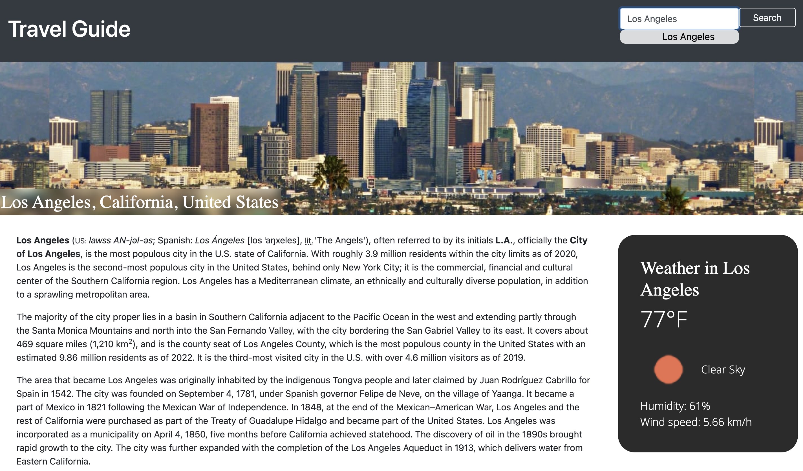

# Travel Guide

## UCLA Bootcamp Project #1

## Description

This website is a travel guide for a user who wants to explore different places to visit. Upon seeing the website, they will see a few recommended cities. Upon searching, the user will see:

1. Information about the city
2. Sightseeing and top attractions
3. Top hotels to stay
4. Suggested popular restaurants
5. Current weather in the city
6. A map overview of the city

## Installation

This website can be used via GitHub Pages at https://ramitaarora.github.io/travel-guide/.

## Usage

## Credits

This website was created by Ramita Indurkhya, Daniel Miranda, Shawn Dreifuss and Justin Chun.